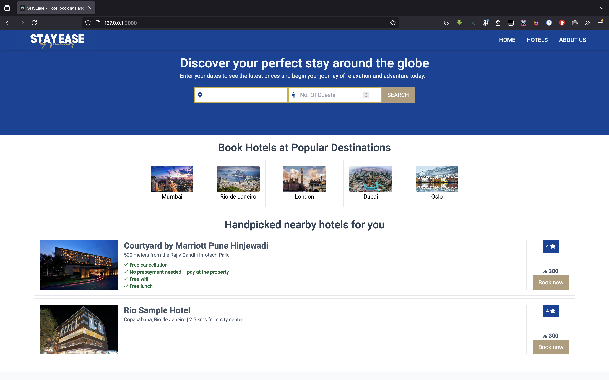
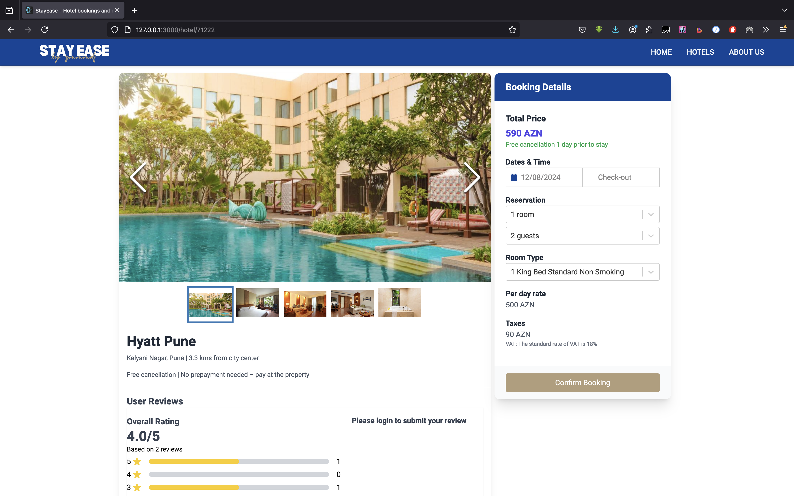
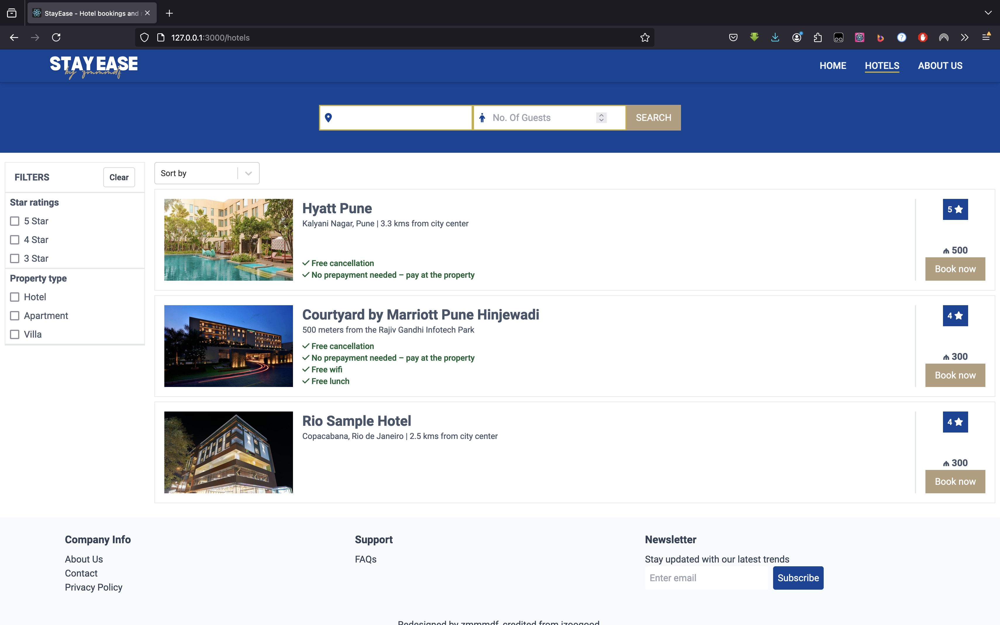
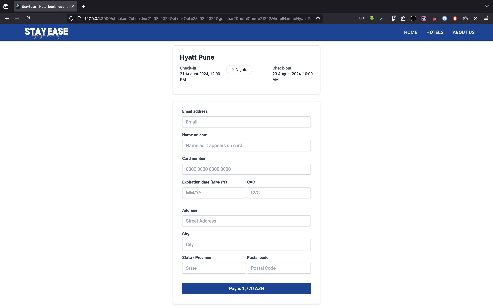
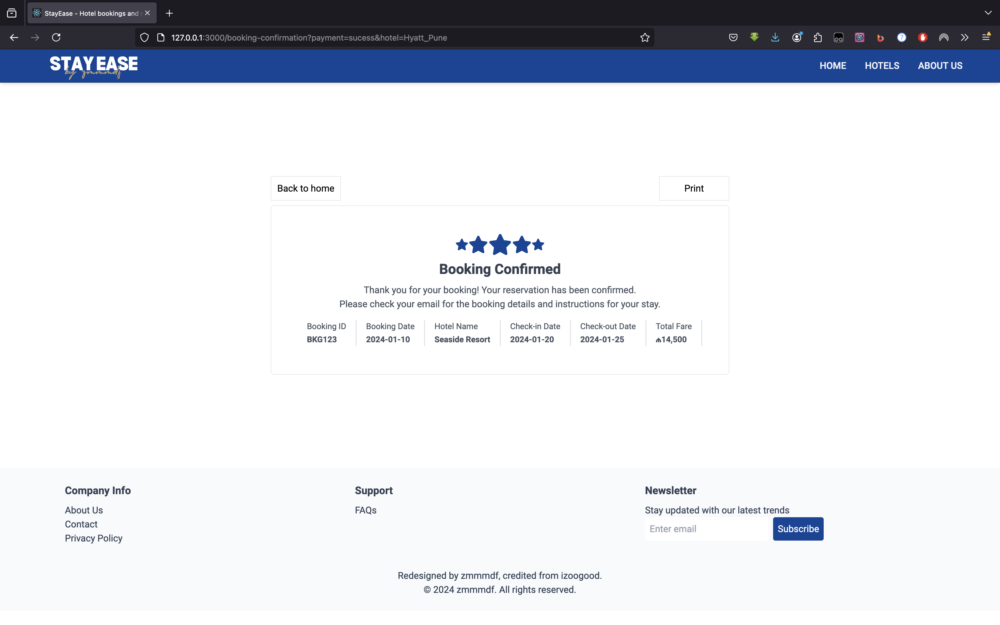

<div align="center">
	<p>
		<sup>Maintained by:</sup>
		<br>
		<br>
		<a href="https://github.com/zmmmdf">
			
		</a>
        <p>
        Effortless Booking, Exceptional Stays
        </p>
	</p>
	<hr>
</div>


StayEase is a hotel reservation system designed to help users search for and book accommodations. It features a comprehensive backend API built with .NET and a responsive frontend interface. This README provides an overview of the project, instructions for setting up both the backend and frontend, and other relevant details.

## Table of Contents

- [Project Overview](#project-overview)
- [Frontend](#frontend)
- [Backend](#backend)
- [Running the Project](#running-the-project)
- [Screenshots](#screenshots)
- [Contributing](#contributing)
- [License](#license)

## Project Overview

StayEase consists of two main components:

1. **Frontend**: Built with modern JavaScript libraries and frameworks. It provides a user-friendly interface for searching hotels, viewing details, and making reservations.

2. **Backend**: Developed using .NET (C#). It handles API requests, processes reservations, and interacts with the database.

### Features

- Search for hotels by city, star rating, and price range.
- View detailed hotel information including images, benefits, and reviews.
- Make reservations with support for checking availability.
- Admin interface for managing hotels and reservations.

## Frontend

The frontend of StayEase is located in the `Frontend` folder. It uses npm to manage dependencies and scripts. 

### Setup

1. **Navigate to the Frontend folder:**

    ```sh
    cd stay-ease/Frontend
    ```

2. **Install dependencies:**

    ```sh
    npm install
    ```

3. **Start the development server:**

    ```sh
    npm start
    ```

   This will start the frontend application, usually accessible at `http://localhost:3000`.

### Frontend Details

- **Homepage**: Displays popular destinations and available hotels.
- **Hotel Details Page**: Shows detailed information about a selected hotel, including reviews and booking options.
- **Search Page**: Allows users to filter hotels based on various criteria.

For more details on the frontend setup, refer to the [Stay Booker Pro GitHub Repository](https://github.com/iZooGooD/stay-booker-pro).

## Backend

The backend of StayEase is located in the `Backend` folder. It is built using .NET and C#. The backend handles API requests, manages data, and performs operations related to reservations and hotel information.

### Setup

1. **Navigate to the Backend folder:**

    ```sh
    cd stay-ease/Backend
    ```

2. **Restore dependencies and build the project:**

    ```sh
    dotnet restore
    dotnet build
    ```

3. **Run the project:**

    ```sh
    dotnet run
    ```

   This will start the backend server, usually accessible at `http://localhost:5237`.

### Backend Details

- **API Endpoints**: Includes routes for managing hotels, reservations, and user data.
- **Data Models**: Defined in `/Models` and modified in `ApplicationDbContext.cs` and include models like `Reservation`, `Hotel`, and `Review`.
- **Controllers**: Handle API requests and interact with the database.

## Running the Project

To run the full StayEase application:

1. **Start the Backend Server:**

    ```sh
    cd stay-ease/Backend
    dotnet run
    ```

2. **Start the Frontend Development Server:**

    ```sh
    cd stay-ease/Frontend
    npm install
    npm start
    ```

   Ensure that the backend server is running before starting the frontend to allow API requests to succeed.

## Screenshots

Here are some screenshots of the StayEase project:
<h2>Homepage</h2>


<h2>Hotel Details Page</h2>


<h2>Search Page</h2>


<h2>Booking Page</h2>


<h2>Success Page</h2>


## Contributing

Contributions to StayEase are welcome. To contribute:

1. Fork the repository.
2. Create a new branch for your changes.
3. Commit your changes and push to your fork.
4. Submit a pull request describing your changes.

## License

This project is licensed under the MIT License. See the [LICENSE](LICENSE) file for details.